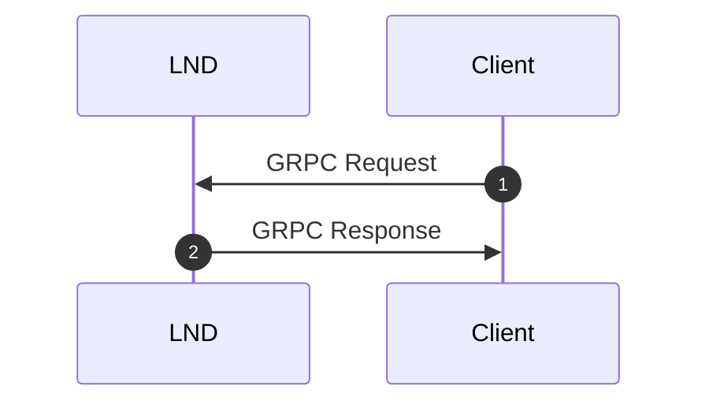
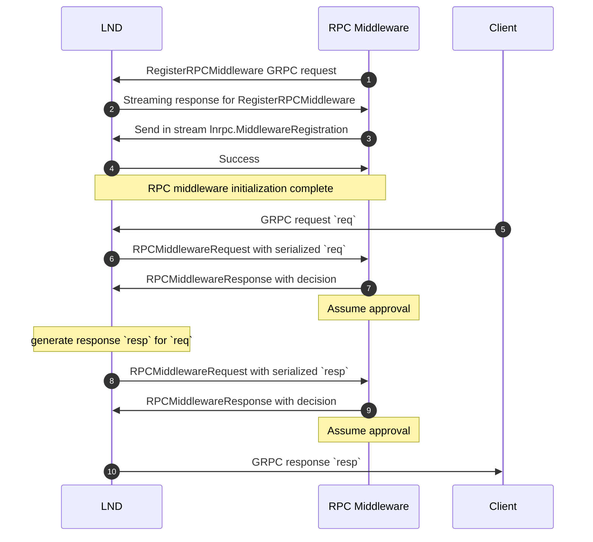

## Project Summary

This project, `lnd-custom-permissions`, is designed to extend and customize permissions within the LND. It allows more fine-grained control over permission than default macaroon system.
It allows specifying conditions for some RPC calls.

LND access system is based on macaroons. It specifies which calls are authorized and which are not. It works on per RPC type basis. There a set of allowed calls. It is not currently possible to specify for example parameters for which call should be called. For example it is possible to authorize `OpenChannel` call, but it is not possible to authorize `OpenChannel` call only when push_amt<=MAX_PUSH_AMT.
https://docs.lightning.engineering/lightning-network-tools/lnd/macaroons

This application tries to solve this issue for user-case of channel management. 
It is implemented using LND RPC interceptor. Conditions are encoded into a custom caveat in a macaroon.
When intercepting RPC call conditions are extracted and checked. If they are met interceptor returns no error thus continuing the call execution.
https://docs.lightning.engineering/lightning-network-tools/lnd/rpc-middleware-interceptor

## Usual RPC call


## RPC call with RPC interceptor


## Example usage
Examples are given using `devenv` because commands require a lot of configuration parameters and thus it is easy to put them into a shell scripts.

1. Go to `devenv` directory. It works only from its directory.

2. Initialize `devenv`
    
    2.1 Follow steps from `README.md` for devenv. Basically put path to lnd source in `.env` and launch a script.
    
    2.2 Launch bitcoind in one terminal(it is better to launch each app in its own terminal because logs are easier to read)
    ```shell
        $ ./start-bitcoind-1.sh
    ```

    2.3 Launch lnd-1 in second terminal
    ```
        $ ./start-lnd-1.sh
    ```

    2.4 Launch lnd-2 in third terminal
    ```
        $ ./start-lnd-2.sh
    ```

    2.5 Initialize bitcoind-1 wallet:
    ```
        $ ./setup-bitcoind-1.sh
    ```

    2.6 Setup two lnd nodes(it may take some time):
    ```
        $ ./setup-net-lnd-1-2.sh
    ```

3. Generate custom macaroon:
```
    $ ./lcp-create-custom-macaroon.sh
```
It creates files with custom macaroon `tmp/lnd-1-custom.macaroon`

4. Check content of custom macaroon
``` shell
$ lncli printmacaroon --macaroon_file tmp/lnd-1-custom.macaroon
{
        "version": 2,
        "location": "lnd",
        "root_key_id": "0",
        "permissions": [
                "uri:/lnrpc.Lightning/AddInvoice",
                "uri:/lnrpc.Lightning/BatchOpenChannel",
                "uri:/lnrpc.Lightning/CloseChannel",
                "uri:/lnrpc.Lightning/ConnectPeer",
                "uri:/lnrpc.Lightning/DebugLevel",
                "uri:/lnrpc.Lightning/DescribeGraph",
                "uri:/lnrpc.Lightning/DisconnectPeer",
                "uri:/lnrpc.Lightning/FeeReport",
                "uri:/lnrpc.Lightning/ForwardingHistory",
                "uri:/lnrpc.Lightning/GetChanInfo",
                "uri:/lnrpc.Lightning/GetInfo",
                "uri:/lnrpc.Lightning/GetNetworkInfo",
                "uri:/lnrpc.Lightning/GetNodeInfo",
                "uri:/lnrpc.Lightning/GetNodeMetrics",
                "uri:/lnrpc.Lightning/GetRecoveryInfo",
                "uri:/lnrpc.Lightning/ListAliases",
                "uri:/lnrpc.Lightning/ListChannels",
                "uri:/lnrpc.Lightning/ListInvoices",
                "uri:/lnrpc.Lightning/ListPeers",
                "uri:/lnrpc.Lightning/ListPermissions",
                "uri:/lnrpc.Lightning/LookupInvoice",
                "uri:/lnrpc.Lightning/OpenChannel",
                "uri:/lnrpc.Lightning/QueryRoutes",
                "uri:/lnrpc.Lightning/SubscribeChannelGraph",
                "uri:/lnrpc.Lightning/SubscribePeerEvents",
                "uri:/lnrpc.Lightning/UpdateChannelPolicy",
                "uri:/routerrpc.Router/SendToRouteV2"
        ],
        "caveats": [
                "time-before 2025-12-24T12:34:59.522168809Z",
                "lnd-custom rpc-interceptor-caveat 1-eyJBZGRJbnZvaWNlIjp7Ik1heFZhbHVlU2F0IjoyMDAwMDAsIkFsbG93ZWRQYXltZW50QWRkcmVzc2VzIjpudWxsfSwiT3BlbkNoYW5uZWwiOnsiTWF4UHVzaEFtb3VudFNhdCI6MH0sIkNsb3NlQ2hhbm5lbCI6eyJBbGxvd2VkRGVsaXZlcnlBZGRyZXNzZXMiOltdfSwiU2VuZFBheW1lbnRWMiI6eyJBbGxvd2VkRGVzdGluYXRpb25zIjpbIjAyOGM5NDY0N2FjN2RmNTBkOTliNWQ1YTMzNGJiYzNjN2MyOGE0Y2U5MmQ5NDZiN2Q2OWViMmI5MDAwMzRmN2JjYyJdfX0="
        ]
}
```

It contains list of authorized call and some custom information. This additional information is stored in custom caveat `rpc-interceptor-caveat`. Its base64 encoded json prefixed with "1-".
```shell
$ echo eyJBZGRJbnZvaWNlIjp7Ik1heFZhbHVlU2F0IjoyMDAwMDAsIkFsbG93ZWRQYXltZW50QWRkcmVzc2VzIjpudWxsfSwiT3BlbkNoYW5uZWwiOnsiTWF4UHVzaEFtb3VudFNhdCI6MH0sIkNsb3NlQ2hhbm5lbCI6eyJBbGxvd2VkRGVsaXZlcnlBZGRyZXNzZXMiOltdfSwiU2VuZFBheW1lbnRWMiI6eyJBbGxvd2VkRGVzdGluYXRpb25zIjpbIjAyOGM5NDY0N2FjN2RmNTBkOTliNWQ1YTMzNGJiYzNjN2MyOGE0Y2U5MmQ5NDZiN2Q2OWViMmI5MDAwMzRmN2JjYyJdfX0= | base64 --decode | jq -r "."
{
  "AddInvoice": {
    "MaxValueSat": 200000,
    "AllowedPaymentAddresses": null
  },
  "OpenChannel": {
    "MaxPushAmountSat": 0
  },
  "CloseChannel": {
    "AllowedDeliveryAddresses": []
  },
  "SendPaymentV2": {
    "AllowedDestinations": [
      "028c94647ac7df50d99b5d5a334bbc3c7c28a4ce92d946b7d69eb2b900034f7bcc"
    ]
  }
}
```

5. Create watcher macaroon
```shell
$ ./lcp-create-watcher-macaroon.sh
```

6. Check content of watcher macaroon
```shell
$ lncli printmacaroon --macaroon_file tmp/lnd-1-watcher.macaroon
{
        "version": 2,
        "location": "lnd",
        "root_key_id": "0",
        "permissions": [
                "uri:/lnrpc.Lightning/GetInfo",
                "uri:/lnrpc.Lightning/RegisterRPCMiddleware"
        ],
        "caveats": [
                "time-before 2025-12-24T12:39:55.32826099Z"
        ]
}
```
It is very limited macaroon. It contains only two allowed RPC.

7. Start lnd watcher
```shell
$ ./lcp-watch-lnd.sh
```

8. Check that watcher works.

    8.1 call `AddInvoice` with small amount. It should work.
    ```shell
    $ ./lncli-1-with-custom-macaroon.sh addinvoice --amt 1000
    {
        "r_hash":  "a9d5d5ec0c58783a2153d5ad311c5eb6920409462fb05e6ec68e97c7de096169",
        "payment_request":  "lnbcrt10u1pnk4trxpp5482atmqvtpur5g2n6kknz8z7k6fqgz2x97c9umkx36tu0hsfv95sdqqcqzzsxqyz5vqsp5ys5sjmhcq783jwpr0td8k40gnppzp9vtekx9rw0fgtturflswxrs9qxpqysgqcux7zy4uvcqemtv8gp00qwyf29ssnclp48n64uectzhcxdj5l9uyahtd7ryuu3r65au0vfcwmjujvvasecqguyyclrgr0584st690acq00hg4f",
        "add_index":  "1",
        "payment_addr":  "2429096ef8078f1938237ada7b55e8984220958bcd8c51b9e942d7c1a7f07187"
    }
    ```

    8.2 Call `AddInvoice` with large amount. It should not work.
    ```shell
    $ ./lncli-1-with-custom-macaroon.sh addinvoice --amt 1000000
    [lncli] rpc error: code = Unknown desc = interceptor rejected this request: verification failed: invoice value in satoshis 1000000 is greater than the allowed maximum 200000
    ```
